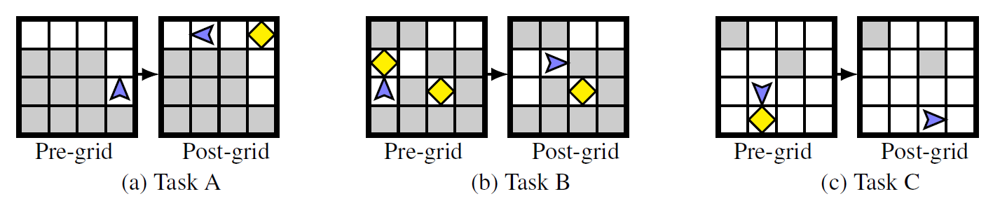

# 🚀 Karel AVATAR: Solving Karel Tasks with Deep Reinforcement Learning

## Introduction

Welcome to the Karel RL project, where we delve into the exciting world of visual programming. In this course project, we continue to use a block-based visual programming paradigm, solving tasks within the Karel Environment with basic actions. Our focus is on assembling a sequence of commands (code blocks) to solve visual tasks on $4 \times 4$ grids, restricting ourselves to fundamental actions without involving programming constructs like conditionals or loops.

## Problem Statement

To solve a given Karel task, you need to transform the Pre-grid to Post-grid using a sequence of commands that must end with the 'finish' command. Your objective is to achieve this without any "crashes" during execution and with the minimal number of commands. The challenge lies in strategic thinking to optimize the command sequence for efficiency.

### Example Task

For instance, consider the following Karel `Task A` (see Figure 1 below) that can be solved with a minimal-sized command sequence: {move, move, turnLeft, putMarker, move, move, finish}.

Figure 1: Karel task with a $4 \times 4$ grid.

In this example, the Pre-grid represents the initial state, and the Post-grid is the target state. The task is to maneuver Karel from the starting point to the finishing point, placing markers strategically, and finally executing the 'finish' command. Your challenge is to devise a concise sequence of commands that achieves this transformation efficiently.

## Dataset

For training and validation, access the dataset [here](link_to_your_dataset). The dataset includes a variety of tasks and corresponding command sequences to help you train and evaluate your models effectively.

## Installation Instructions

Follow these steps to set up the environment:

1. **Register the Environment**
   - Change the default JSON entry in `grid_world.py` on line 16 with the location of the JSON file provided in the 'Environment' folder (`0_task.json`).
   - Change the default JSON entry in `__init__.py` on line 6 with the location of the JSON file provided after opening the 'Environment' folder (`0_task.json`).
   - Run `pip install pathtoenv/Environment` (replace `pathtoenv` with the path to the 'Environment' folder).

2. **Install Requirements**
   - Run `pip install -r requirements.txt` present in the project folder.

3. **Configure Paths in `main.py`**
   - Edit paths at lines 33, 95, 153, and 193 to set to the list of JSON files related to training data and the location to save your trained model.

4. **Configure Paths in `validate.py`**
   - Edit paths at lines 16, 25, 36, and 37 to set the locations for loading the trained model, the validation dataset, tasks JSON file, and sequences JSON file.

5. **Run Training and Validation**
   - Run the training file as `python main.py`.
   - Run the validation file as `python validate.py`.

## Gym Functionality

The `grid_world.py` file inside the 'Environment/gym_examples/envs/' folder contains a render function for the gym environment. To render the current state, call `env.reset()` and then `env.render()`. Utilize `env.step(action)` to observe how render changes the state space after each step.

**Legend for `render()` Function:**
- `e`, `w`, `n`, `s` at cell [i, j] represent the agent's location and associated direction (e: east, w: west, n: north, s: south).
- `E`, `W`, `N`, `S` at cell [i, j] indicate the presence of a marker in addition to the agent.
- `#` (hash) represents the location of walls.
- `M` at cell [i, j] signifies a marker at that location.

Feel free to explore the Karel AVATAR project and embark on this visual programming challenge! 🤖💻✨